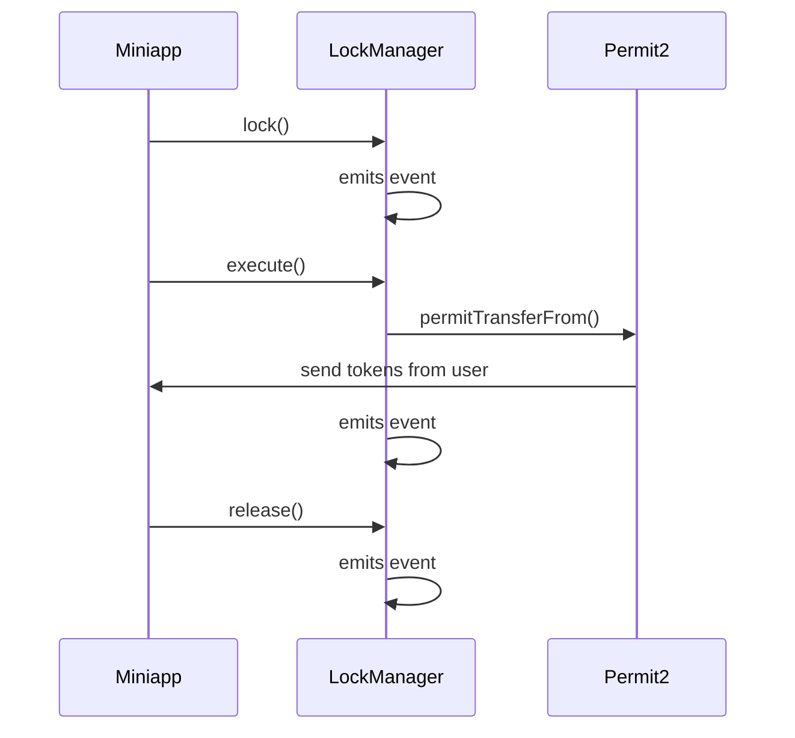

# Mutex Protocol

Shared lock registry for World App miniapps.

## Overview

A single contract, called `LockManager`, maintains a registry of lock assignments and executes Permit2 transfers while routing funds to lock holders. 

---

## Architecture

### Components

**Storage**

```solidity
struct Lock {
    address holder;  // address of the consuming protocol
    uint40 expiresAt;  // unix timestamp when lock expires
}

mapping(address user => Lock) public locks;
```

**Functions**

- `lock(user, expiration)` — user assigns their lock and `msg.sender` is holder of lock
- `release(user)` — holder (`msg.sender`) returns lock to user
- `execute(permit, transferDetails, user, signature)` — holder (`msg.sender`) provides permit for execution and routing

**Permit2 Integration**

- Permit2s are generated and tracked by the consumer miniapps, and provided to the `LockManager` on execution
- On execution, `LockManager` transfers tokens from the user to consumer’s protocol provided address in `transferDetails` using the provided Permit2. All ERC20s are supported, including WLD, USDC, etc.
- TFH can optionally implement informed consent popup in World App when generating permits with the `LockManager` as spender

**Access Control** 

Only addresses verified and added to the AuthorizedPartner registry by the **Protocol Governance** (representing World/TFH/Foundation) are permitted to invoke lock-lifecycle methods.

This separates the high-level governance (who can manage partners) from the operational execution (who can manage locks)

1.  The Partner Registry (The "Allowlist")
    - `mapping(address => bool)` or an `AccessControl` enumerable list
    - **Update Policy:** Only callable by the DEFAULT_ADMIN_ROLE
2. Execution Guard (The Modifier)
    
    To ensure system integrity, all state-changing functions regarding locks `create() execute() and release()` are protected by a Validation Gatekeeper.
    

**Operational Continuity Post-Revocation:** What is the intended state of 'In-Flight' locks if a partner’s authorization is revoked? Should the system enforce **Immediate Termination** (invalidating existing locks) or **Graceful Deprecation** (allowing existing locks to resolve while preventing new originations)?

## Flow

### Miniapp

1. Generates Permit2s with `LockManager` as spender address
2. `ISignatureTransfer.PermitTransferFrom` data and signatures are sent to the miniapp’s contract, which manages/handles them
3. On the same transaction as above (or separately), the miniapp (from its protocol contract) calls `lock` on the `LockManager` contract, passing the user’s address and expiration tiemstamp.

### Lock Lifecycle

1. On `lock`, registry updated: `locks[user] = Lock({msg.sender, expiration})` and event emitted
2. Holder (`msg.sender` aka miniapp protocol contract) has exclusive rights to:
    - **Execute** — use provided permit information to execute transfer, and route tokens to the holder (lock persists)
    - **Release** — holder returns lock to the protocol (i.e. lock is cleared)
3. Lock (lazily) expires once the expiration is reached

### Tokens Routing

1. User claims WLD from World → funds arrive in user’s wallet
2. Holder (miniapp’s protocol contract) calls `execute` function passing:
    - `permit`: `ISignatureTransfer.PermitTransferFrom` struct
    - `transferDetails` : `ISignatureTransfer.SignatureTransferDetails` struct. for example:
    
    ```solidity
    transferDetails: ISignatureTransfer.SignatureTransferDetails({
        requestedAmount: 10 * 10 ** 18,  // 10 WLD
        to: address(this)  // Receive tokens in this address
    })
    ```
    
    - `user` : user’s wallet address to fetch tokens from
    - `signature`: user’s wallet signature of `permit` object/struct
3. `LockManager` verifies that the caller holds a lock for the user:
    - **Lock active?** → execute permit and route funds to `to` parameter from `transferDetails` object
    - **No lock / expired?** → revert (funds stay with user)

---

## Contract Interface

```solidity
interface ILockManager {
    /// @notice Caller creates a lock for a user
    /// @param user Address of the user that gets locked
    /// @param expiration Timestamp when lock expires
    function lock(address user, uint256 expiration) external;

    /// @notice Holder releases lock of user
    /// @param user Address of the user that is locked
    function release(address user) external;

		/// @notice Execute a permit transfer from user to lock holder
		/// @param permit The permit data signed over by the user
		/// @param transferDetails The holder's requested transfer details for the permitted token
		/// @param user The owner of the tokens to transfer
		/// @param signature The user's signature for the permit
		function execute(
		    ISignatureTransfer.PermitTransferFrom memory permit,
		    ISignatureTransfer.SignatureTransferDetails calldata transferDetails,
		    address user,
		    bytes calldata signature
		) external;

    /// @notice Gets lock information for a user
    /// @param user Address to get lock for
    function getLock(address user) external view returns (Lock);
    
    /// @notice Indicates if user is locked
    /// @param user Address to check lock for
    function isLocked(address user) external view returns (bool);
}
```

## Why This Design

1. Solves race condition problem:

User has a single lock at a time, managed by the holder of the lock (miniapps) — funds from user can only be fetched using Permit2 by the holder of the lock, preventing the race condition scenario. This design allows miniapps for full flexibility on how to use and manage Permit2s, while enforcing fair locking system. Miniapps must lock a user responsibility and must make sure that locks are released once funds are claimed. If a miniapp is not following the established rules, such as not releasing locks after user’s funds have been consumed, World/TFH/World Foundation and Divine will remove the miniapp from the allowlist, preventing usage of locks and permits.

1. Minimal World infrastructure changes

The only required change from World is to enforce that these long-standing permits should be only generated with the `LockManager` as the spender address. Optionally, the World team can also introduce a informed consent popup as described [here](https://www.notion.so/LockManager-Single-Registry-with-Routing-2f4aac3c55158055bb07c7786f609cb3?pvs=21).

Permit2 mechanism and generation remains the same, including signature injection by World’s backend. **Most importantly, this design follows World’s enforcement of ONLY using Permit2’s `SignatureTransfer` instead of `AllowanceTransfer`, making it much more secure and manageable.**

## Lock Flow

